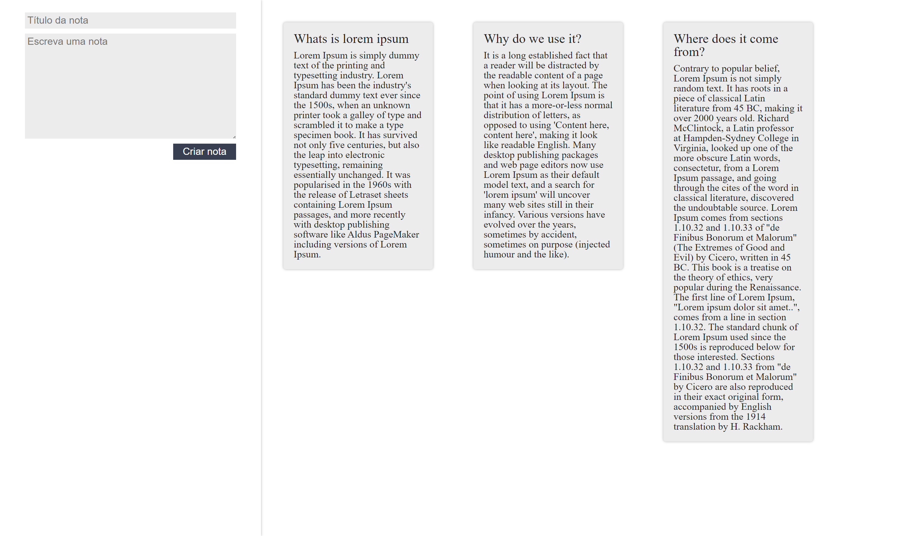

# Curso de React: entendendo como a biblioteca funciona

## O que foi visto no curso:

<ul>
  <li>Aprenda a criar class components dentro do React</li>
  <li>Saiba como passar informações entre os componentes</li>
  <li>Entenda como o "this" funciona dentro do Javascript</li>
  <li>Crie Sites com mais facilidade</li>
  <li>Conheça como o React funciona para otimizar seus sites</li>
</ul>

## Preview

